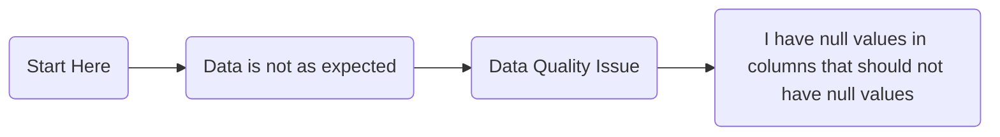

# Spark Data Quality Issue Flowchart

This flowchart aims to guide users through common data quality issues encountered when working with Spark. Follow the path that best describes your issue.

```mermaid
flowchart LR
    Start("Start Here") --> DataNotExpected("Data is not as expected") --> DataQualityIssue("Data Quality Issue") --> NullValues("I have null values in columns that should not have null values")
    
    click NullValues href "docs/details/data-is-not-as-expected.md" "Handling Unexpected Null Values in Columns"
```
