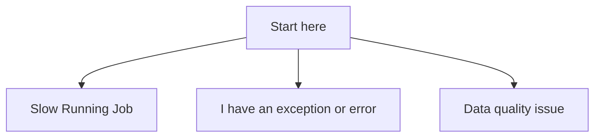

Spark Error Flowchart: Note this uses mermaid.js which may take awhile to load.

```mermaid
graph TD
  A[Start here] --> B[Slow Running Job]
  A[Start here] --> C[I have an exception or error]
  A[Start here] --> D[Data quality issue]
  click B "slow" "Slow"
  click C "error" "Error"
  click D "data-quality" "Data Quality Issue"
```
